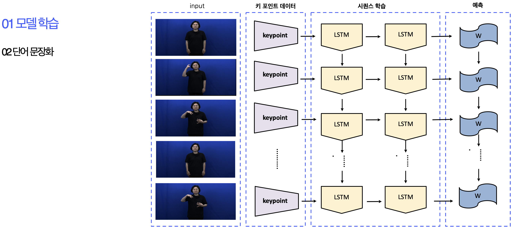
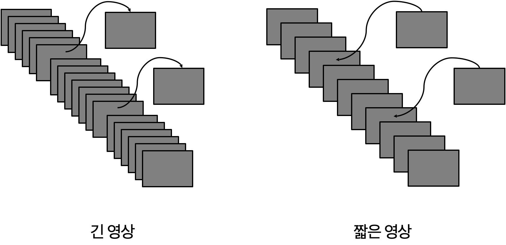

# sign_language_translator

## 프로젝트 소개
청각 장애인들과 소통하기 위하여 만든 AI 수어번역 프로그램입니다.

## 기술스택

## 프로젝트 개요

청각 장애는 전체 장애 인구 중 2위를 차지할 정도로 많습니다.\
또한 수어를 중점적으로 사용하는 농인은 병원에 상주하는 통역사가 적기 때문에 의료 서비스를 받는 데에 불편함이 많습니다. 

웹 캠을 통해서 사용자의 동작을 읽어 수어를 번역할 수 있습니다.

## 모델 학습 데이터셋

### AI Hub 수어 데이터셋 
105개 문장, 419개 단어를 10명의 수어 전문가를 2대의 카메라로 동영상 획득(10,480개 동영상)\
https://www.aihub.or.kr/aihubdata/data/view.do?currMenu=120&topMenu=100&aihubDataSe=extrldata&dataSetSn=264

## 기능
웹 캠을 통하여 사용자의 동작을 읽어 수어 한 말을 읽을 수 있습니다

### 딥러닝 기반 수어 번역 모델
수어 동영상 데이터를 프레임 단위로 키포인트를 추출하여 LSTM 시계열 데이터로 학습시켰습니다.\

\
길이가 다른 수어들을 프레임을 추가하고 삭제하는 방식으로 데이터의 길이를 맞추어 주었습니다.
